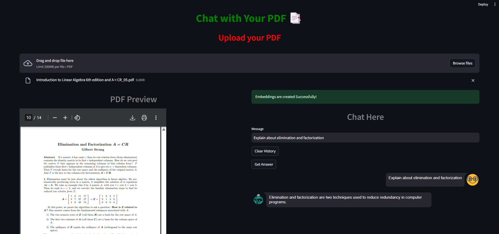

metadata
title: Chat With Doc
emoji: 😻
colorFrom: gray
colorTo: pink
sdk: streamlit
sdk_version: 1.29.0
app_file: app.py
pinned: false
license: mit

**Project Title:** **DocuChat AI – Chat with PDF via Upload or RAG**

**Description:**

A lightweight RAG-based PDF chatbot that enables real-time interaction with uploaded documents using open-source LLMs and embedding models.

**Tech Stack:**

- **LLM:** LaMini-T5 (738M) via HuggingFace Pipelines
- **Embeddings:** all-MiniLM-L6-v2 (SentenceTransformers)
- **Vector Store:** Chroma (in-memory & persisted)
- **Frameworks:** LangChain, Streamlit

**Highlights:**

- Integrated RetrievalQA pipeline with HuggingFacePipeline LLM for grounded responses.
- PDF ingestion using PDFMinerLoader and chunking via RecursiveCharacterTextSplitter.
- Real-time PDF rendering alongside chat using Streamlit.
- Fully CPU-optimized and resource-efficient deployment.
- Persistent vector storage to avoid recomputation.
- Maintains session-based chat history with reset functionality.

**Purpose:**

To explore and demonstrate the power of RAG for document-based question answering using minimal infrastructure and open-source tools.

